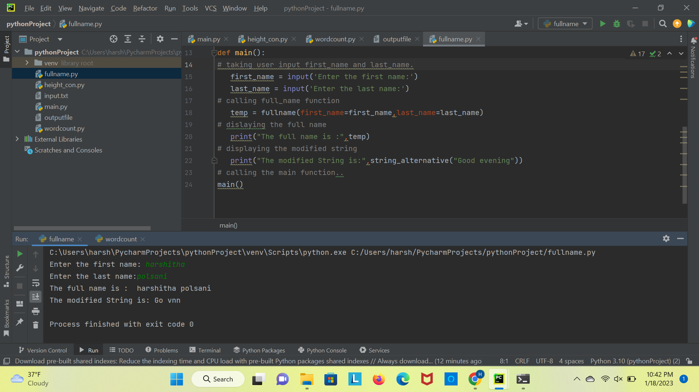
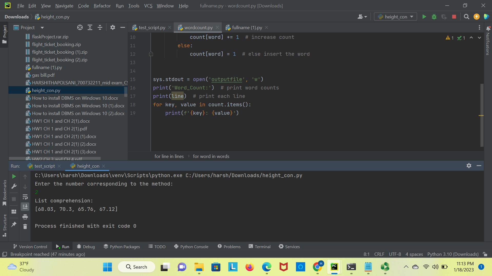
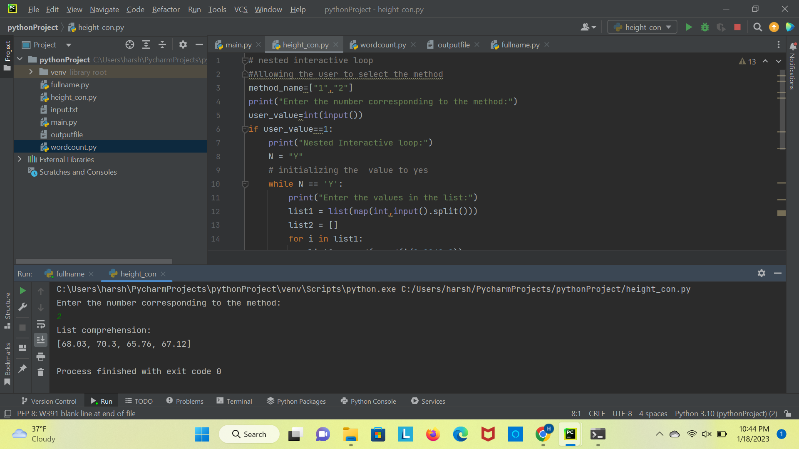

# Assignment2
# Summary

**In the first question**

- i. I am using input() to read the input from console, by default it is a string and in Python string is mutable.
     I am slicing the variable with negative values to fetch the values within the limit and reversing it using (::) to jump the sequence
     
 
- ii. In the second part of the first question, I am fetching the values from console using input() function.
      converting the inputs to integers using int() and printing the arithmetic operations.

**In the second question:**

- I am taking the sentence from the console using input() and using replace function. The first argument should be
  the value that should be replaced and the second argument in the replace function should be the value that  replaces
  the first argument.

**In the third question:**

- I am reading the percentage from the console using input() and converting it to int using int().
- I am using if, elif and else conditions to filter the percentage and allot the related grade to it.

Video Link: <a href="https://ucmo.hosted.panopto.com/Panopto/Pages/Viewer.aspx?id=0a62995b-ec80-440b-a867-af8f0051d94e" target="_blank"> CLICK HERE </a>

